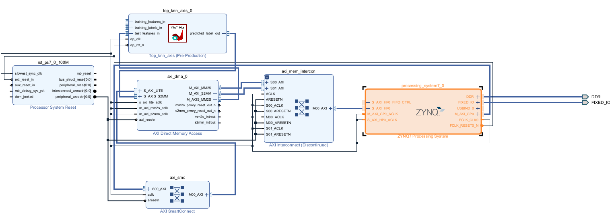

## Table of Contents
- [Overview](#overview)
- [Features](#Features)
- [Contact](#contact)

## Overview

k-NN implemantation Design
Xilinx Arty Z7-20
part=xc7z014sclg400-1

**flow_target=vitis
**package.output.format=ip_catalog
**package.output.syn=1
**csim.clean=1
**sim.O=1
**csim.code_analyzer=0
**syn.top=top_knn_axis
**tb.file=knn_test.cpp
**csim.setup=0
**syn.file=knn.h
**syn.file=knn_axis.h
**syn.file=top_knn_axis.cpp

## Features

